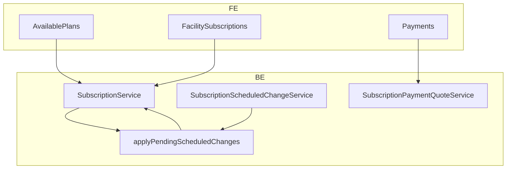

# Facility Subscription & Billing — Implementation Plan

**Date:** 2026-05-26  
**Status:** Approved for execution (decisions locked below)  
**Scope:** Frontend (`Frontend/`) + Backend (`Backend/`) — Plans & Subscriptions (facility admin)

---

## 1. Overview

### Problem today

- **Cancelled** on Subscriptions tab but **Current Plan** still shown on Available Plans (`isCurrent` = `plan.id` only).
- Cancel and plan changes **apply immediately** (access lost, cancel + recreate on upgrade/downgrade).
- `Payments.tsx` uses `plan price + onboarding` without context (renewal, onboarding already paid, upgrades).
- Trial copy hardcoded as **7 days**; BE already uses `plan.trial_days`.
- No proration, no scheduled changes table, no server-side payment quote.

### Goals

1. Truthful UI (current / scheduled / cancelled-with-access).
2. **Cancel at period end** when the facility has paid for the current cycle.
3. **Scheduled** upgrade/downgrade at **next billing cycle** (no charge now).
4. **Upgrade now** with **proration** (charge today, plan upgrades immediately).
5. **Payment quote** API drives `Payments.tsx`; server validates amounts.
6. **No cron** for scheduled changes — apply pending changes via a shared function whenever subscription state is resolved (read path + middleware).

---

## 2. Decisions (locked)

| # | Question | Decision |
|---|----------|----------|
| 1 | When cancelling after payment for this cycle, when does access end? | **End at period end** (`ends_at` / paid-through date), not immediately. |
| 2 | Who can cancel immediately (instant lockout)? | **Platform admin only.** Facility-facing cancel = **at period end** only. |
| 3 | When do scheduled upgrade/downgrade take effect? | **Next billing cycle** (`next_billing_date` / `effective_at`). |
| 4 | Charge when scheduling upgrade/downgrade for next cycle? | **No charge now** — new price at renewal. |
| 5 | Upgrade paths? | **Two paths:** (A) **Schedule upgrade** — next cycle, no payment now. (B) **Upgrade now** — plan changes immediately; **proration applies**; user pays quoted delta via Payments. |
| 6 | Proration formula (upgrade now)? | Daily within current period: `credit_unused = old_price × (days_remaining / days_in_period)`; `charge_new = new_price × (days_remaining / days_in_period)`; `due = max(0, charge_new − credit_unused)`. Store breakdown in payment / metadata. |
| 7 | Downgrade mid-cycle refund? | **No refund / no credit** in v1. Higher plan until period end; lower price from next cycle. |
| 8 | Currency? | **USD only** for v1 (matches existing Payments + bank transfer). |
| 9 | Plan card labels? | **Your plan** (informative pill, Custocare blue/cyan — not gray disabled button). **Starts on {date}** for scheduled target. **Access until {date}** when cancelled-at-period-end. No **Current** when `!has_access`. |
| 10 | Server validates payment amount? | **Yes** — `GET payment-quote` + reject `POST payment` if amount ≠ quote (±$0.01). |
| 11 | When are pending scheduled changes applied? | **On demand only** — `applyPendingScheduledChanges()` when subscription is loaded or access checked (**no cron job**). |
| 12 | Trial length? | Always **`plan.trial_days`** per plan (FE + BE); remove hardcoded 7-day copy. |

### Upgrade summary

| Action | Plan change | Payment now | Proration |
|--------|-------------|-------------|-----------|
| Schedule upgrade | Next billing cycle | No | No |
| Upgrade now | Immediate | Yes (quoted) | Yes |
| Schedule downgrade | Next billing cycle | No | No |
| Cancel (facility) | Cancelled at period end | No | No |

---

## 3. Architecture



### Apply pending changes (no cron)

`applyPendingScheduledChanges(Subscription $subscription): Subscription` runs when:

- `GET /api/facilities/{facility}/subscription`
- `SubscriptionService::getSubscriptionForFacility()` (internal)
- `EnsureFacilitySubscriptionIsActive` middleware (before access decision)

Logic:

1. Load `pending` row from `subscription_scheduled_changes` where `effective_at <= now()`.
2. If none, return subscription unchanged.
3. Apply by `change_type`:
   - `upgrade` / `downgrade` / `plan_change` → update `plan_id`, sync modules, clear pending row → `applied`.
   - `cancel` → set `status = cancelled`, `cancelled_at`, clear flags → `applied`.
4. For **upgrade now**, do **not** use scheduled row — update `plan_id` immediately in dedicated service method after payment quote / confirmation.

Only **one** pending scheduled change per subscription (DB unique partial index).

---

## 4. Database

### New table: `subscription_scheduled_changes`

| Column | Type | Notes |
|--------|------|--------|
| `id` | bigint PK | |
| `subscription_id` | FK → subscriptions | |
| `facility_id` | FK → facilities | |
| `change_type` | enum | `upgrade`, `downgrade`, `cancel`, `plan_change` |
| `from_plan_id` | FK nullable | |
| `to_plan_id` | FK nullable | null for cancel |
| `effective_at` | timestamp | Usually `subscription.next_billing_date` |
| `status` | enum | `pending`, `applied`, `cancelled` |
| `proration_amount_usd` | decimal nullable | For audit; scheduled upgrade = null |
| `requested_by_user_id` | FK nullable | |
| `metadata` | json nullable | Quote breakdown, notes |
| `timestamps` | | |

**Index:** unique `(subscription_id)` where `status = pending`.

### Subscription model / metadata (cancel at period end)

Until applied cancel row fires:

- `status` remains `active` (or `trial` / `past_due` with access).
- `metadata.cancel_at_period_end` = true
- `metadata.access_ends_at` = ISO8601 (copy of `ends_at`)

`Subscription::hasAccess()` must return true while `now() < access_ends_at` even if cancel is scheduled.

---

## 5. Backend (SOLID)

| Piece | Location |
|-------|----------|
| Migration | `database/migrations/..._create_subscription_scheduled_changes_table.php` |
| Model | `app/Models/SubscriptionScheduledChange.php` |
| Repository interface + impl | `app/Repositories/Billing/Contracts/...`, `.../SubscriptionScheduledChangeRepository.php` |
| Service | `app/Services/Billing/SubscriptionScheduledChangeService.php` |
| Quote service | `app/Services/Billing/SubscriptionPaymentQuoteService.php` |
| Extend | `SubscriptionService` — cancel modes, `upgradeNow()`, `schedulePlanChange()`, wire `applyPendingScheduledChanges` |
| Resource | `SubscriptionResource` — `scheduled_change`, `cancel_at_period_end`, `access_ends_at`, `effective_plan` |
| Provider bindings | `bootstrap/providers.php` (dedicated provider if needed) |
| Routes | `routes/api/...` under facility subscription group |

### API endpoints

| Method | Path | Purpose |
|--------|------|---------|
| GET | `/facilities/{facility}/subscription` | Show subscription; **runs apply pending** before response |
| POST | `/facilities/{facility}/subscription/cancel` | Body: `{ reason?, mode: 'at_period_end' \| 'immediate' }` |
| POST | `/facilities/{facility}/subscription/schedule-change` | Body: `{ plan_id, change_type: 'upgrade' \| 'downgrade' }` |
| POST | `/facilities/{facility}/subscription/upgrade-now` | Body: `{ plan_id }` — immediate plan swap + returns quote reference |
| DELETE | `/facilities/{facility}/subscription/scheduled-change` | Cancel pending scheduled change |
| GET | `/facilities/{facility}/subscription/payment-quote` | Query: `plan_id?`, `intent` — line items + total |

### Payment quote intents

| Intent | Typical total |
|--------|----------------|
| `first_activation` | monthly + onboarding (if not paid) |
| `renewal` | monthly only |
| `scheduled_change` | **0** (copy explains charge at renewal) |
| `upgrade_now` | proration due |
| `trial_activation` | per trial / onboarding rules |

`PaymentService::recordPayment()` validates amount against latest quote for subscription + intent.

### Proration (upgrade now)

```
days_remaining  = calendar days until trial_ends_at (trial) or next_billing_date (active)
days_in_period  = max(1, calendar days between starts_at and period end)
old_price_usd   = subscription.metadata.billing_period_price_usd (locked at activation/renewal)
new_price_usd   = target plan catalog price at quote time (upgrade now)
credit_unused   = old_price_usd * (days_remaining / days_in_period)
charge_new      = new_price_usd * (days_remaining / days_in_period)
proration_due   = round(max(0, charge_new - credit_unused), 2)
```

Persist breakdown in `payments.metadata` and/or `subscription_scheduled_changes.metadata` when relevant.

### Remove anti-pattern

- Stop FE flow: `cancelSubscription` → `createSubscription` for upgrade/downgrade.
- Do not set `status = cancelled` immediately on facility cancel when `mode = at_period_end`.

---

## 6. Frontend

| Area | Files |
|------|--------|
| Types | `SubscriptionTypes.ts` — scheduled change, cancel_at_period_end, quote types |
| Queries | `SubscriptionQueries.ts` — schedule-change, upgrade-now, payment-quote, cancel with mode |
| Available Plans | `AvailablePlans.tsx` — `isCurrent` / badges / Schedule vs Upgrade now CTAs |
| Subscriptions | `FacilitySubscriptions.tsx` — cancelled-at-period-end copy |
| Payments | `Payments.tsx` — consume quote API only |
| Utils | `subscriptionDisplayUtils.ts` (optional) — shared labels |
| Search | `searchModules.ts` — already has contacts; no change required for this plan |

### Available Plans CTAs (active paid, not in trial)

- Target plan **higher price**: **Schedule upgrade** + **Upgrade now** (primary/secondary).
- Target plan **lower price**: **Schedule downgrade** only.
- Current plan: informative **Your plan** pill (not disabled button).

### Trial copy

Use `plan.trial_days` in confirm dialogs and banners.

---

## 7. Implementation order (single execution pass)

Execute in this order to avoid rework:

| Step | Work | Stack |
|------|------|--------|
| **1** | Migration + model + repository + provider bindings | BE |
| **2** | `applyPendingScheduledChanges()` + integrate into `getSubscriptionForFacility` + middleware | BE |
| **3** | Cancel `at_period_end` vs `immediate`; update `hasAccess()` | BE |
| **4** | `schedulePlanChange()` + DELETE pending + `SubscriptionResource` fields | BE |
| **5** | `upgradeNow()` + proration calculator | BE |
| **6** | `SubscriptionPaymentQuoteService` + quote validation on `recordPayment` | BE |
| **7** | API routes + Form Requests + PHPUnit (apply, cancel at period end, proration, quote) | BE |
| **8** | FE types + React Query hooks for new endpoints | FE |
| **9** | `AvailablePlans.tsx` — labels, CTAs, remove cancel+recreate | FE |
| **10** | `FacilitySubscriptions.tsx` — aligned cancelled / access-until copy | FE |
| **11** | `Payments.tsx` — quote-driven line items + intents | FE |
| **12** | Vera fast (+ BE extended if migrations/entities); update `docs/decisions.md` ADR + `Backend/docs/entities.md` | Both |

**Architect (Blue):** Run — 3+ files, cross-stack, new table.  
**Quill:** Update `docs/decisions.md` + `Backend/docs/entities.md` after Vera pass.

---

## 8. Testing checklist

### Backend

- [ ] Facility cancel `at_period_end` → still `has_access` until `ends_at`; after `effective_at`, status `cancelled`.
- [ ] Platform admin `immediate` cancel → instant no access.
- [ ] Schedule upgrade → `plan_id` unchanged until `applyPending` when `effective_at` passed.
- [ ] `applyPending` on GET subscription (no cron).
- [ ] Upgrade now → `plan_id` updates immediately; quote proration matches formula.
- [ ] Payment record rejects amount ≠ quote.
- [ ] Only one pending scheduled change per subscription.

### Frontend

- [ ] Cancelled + access until date → no misleading **Current** badge.
- [ ] Schedule upgrade → banner on target plan with date.
- [ ] Upgrade now → navigates to Payments with proration line items.
- [ ] Trial confirm uses plan’s `trial_days`.
- [ ] **Your plan** pill styling (blue/cyan, not gray disabled).

---

## 9. Out of scope (v1)

- UGX pricing / multi-currency checkout
- Downgrade proration / refunds
- Automated card billing (still bank transfer + admin approve)
- Cron-based subscription jobs for scheduled changes (explicitly **not** used)

---

## 10. Related files (reference)

### Frontend

- `src/renderer/modules/administration/admin-module/ui/plans-and-subscriptions/AvailablePlans.tsx`
- `src/renderer/modules/administration/admin-module/ui/plans-and-subscriptions/FacilitySubscriptions.tsx`
- `src/renderer/modules/administration/admin-module/ui/plans-and-subscriptions/Payments.tsx`
- `src/renderer/modules/administration/admin-module/api/subscriptions/SubscriptionQueries.ts`
- `src/renderer/modules/administration/admin-module/api/subscriptions/SubscriptionTypes.ts`

### Backend

- `app/Services/Billing/SubscriptionService.php`
- `app/Services/Billing/PaymentService.php`
- `app/Models/Subscription.php`
- `app/Http/Controllers/Api/Billing/SubscriptionController.php`
- `app/Http/Resources/Billing/SubscriptionResource.php`
- `app/Http/Middleware/EnsureFacilitySubscriptionIsActive.php`
- `app/Console/Commands/Billing/CheckSubscriptionStatuses.php` (unchanged for scheduled plan changes; may still handle past_due / trial expiry)

---

*Document owner: Mike (orchestrator). Execute Rex against this plan after Oscar confirms no further edits to §2.*

---

# Facility Plan Limits — Rename & Frontend Guards

**Date:** 2026-05-27  
**Status:** Approved for execution  
**Scope:** Frontend (`Frontend/`) + Backend (`Backend/`) — Plan limit column rename and FE guard UI  
**Cross-stack:** Yes (~20 files)  
**Architect (Blue):** Run — 3+ files, cross-stack

---

## 1. What we're doing

### A. Rename `max_patients_per_month` → `max_visits_per_month`

The column is semantically wrong: the code counts **total visits** per month (every encounter), not unique patients. We're renaming the column across the full stack to match reality.

### B. Add frontend limit guards

Three components currently hit backend errors because there's no frontend guard:

| Component | Limit to guard | Current state |
|-----------|---------------|---------------|
| `StaffCreationForm.tsx` | Staff limit + module filtering | No plan entitlements check |
| `AdminFacilitySetup.tsx` → `DepartmentFormDrawer` | Department limit | No plan entitlements check |
| `MRPatientCreate.tsx` / `MRPatientSearch.tsx` | Visit limit | No plan entitlements check |

---

## 2. Implementation order

| Step | Work | Stack | Files |
|------|------|-------|-------|
| **1** | New migration: rename column | BE | `1` |
| **2** | Update PHP model + resources + requests + seeder | BE | `7` |
| **3** | Update TS types + config + entitlements + hook | FE | `4` |
| **4** | Update FE display components (labels, formatting) | FE | `8` |
| **5** | Add staff limit guard to `StaffCreationForm` | FE | `1` |
| **6** | Add department limit guard to `AdminFacilitySetup` + `DepartmentFormDrawer` | FE | `2` |
| **7** | Add visit limit guard to `MRPatientCreate` + `MRPatientSearch` | FE | `2` |
| **8** | Vera fast (FE + BE) + Quill docs | Both | — |

---

## 3. Backend changes (8 files)

### 3.1 New migration

`database/migrations/2026_05_27_000001_rename_max_patients_per_month_on_plans_table.php`

```php
Schema::table('plans', function (Blueprint $table) {
    $table->renameColumn('max_patients_per_month', 'max_visits_per_month');
});
```

### 3.2 Model: `app/Models/Plan.php`

| Change | Before | After |
|--------|--------|-------|
| `@property` docblock | `max_patients_per_month` | `max_visits_per_month` |
| `$fillable` | `'max_patients_per_month'` | `'max_visits_per_month'` |
| `$casts` | `'max_patients_per_month' => 'integer'` | `'max_visits_per_month' => 'integer'` |

### 3.3 Interface: `app/Services/Billing/Contracts/PlanLimitServiceInterface.php`

- Docblock return type: `max_patients_per_month` → `max_visits_per_month`

### 3.4 Service: `app/Services/Billing/PlanLimitService.php`

| Line | Before | After |
|------|--------|-------|
| 33 | `'max_patients_per_month' => $plan->max_patients_per_month` | `'max_visits_per_month' => $plan->max_visits_per_month` |
| 117 | `$maxVisits = $limits['max_patients_per_month']` | `$maxVisits = $limits['max_visits_per_month']` |

### 3.5 Resource: `app/Http/Resources/Billing/PlanResource.php`

| Line | Before | After |
|------|--------|-------|
| 37 | `'max_patients_per_month' => $this->max_patients_per_month` | `'max_visits_per_month' => $this->max_visits_per_month` |

### 3.6 Requests: `StorePlanRequest.php` + `UpdatePlanRequest.php`

| File | Line | Before | After |
|------|------|--------|-------|
| `StorePlanRequest.php` | 33 | `'max_patients_per_month' => 'nullable\|integer\|min:1'` | `'max_visits_per_month' => 'nullable\|integer\|min:1'` |
| `UpdatePlanRequest.php` | 35 | Same | Same |

### 3.7 Seeder: `database/seeders/PlanSeeder.php`

| Lines | Before | After |
|-------|--------|-------|
| 36, 54, 72 | `'max_patients_per_month' => 500/3000/null` | `'max_visits_per_month' => 500/3000/null` |

---

## 4. Frontend changes (15 files)

### 4.1 Types: `SubscriptionTypes.ts`

| Interface | Line | Change |
|-----------|------|--------|
| `PlanLimits` | 118 | `max_patients_per_month` → `max_visits_per_month` |
| `StorePlanRequest` | 506 | Same |
| `FacilityUsageLimits` | 859 | Same |

### 4.2 Config: `planConfig.ts`

- Line 62: type `max_patients_per_month` → `max_visits_per_month`

### 4.3 Entitlements: `entitlements.ts`

- Add `isDepartmentLimitReached(usage, limits)` utility
- Add `isVisitLimitReached(usage, limits)` utility

### 4.4 Hook: `usePlanEntitlements.ts`

- Add `departmentLimitReached` and `visitLimitReached` to the return object
- Both computed via memo from `usage` + `limits`

### 4.5 Display components (rename references)

| File | Change |
|------|--------|
| `Subscription.tsx` (navbar) | Lines 230-231: `l.max_patients_per_month` → `l.max_visits_per_month` |
| `PlanSelectionStep.tsx` | Line 27: type property |
| `AvailablePlans.tsx` | Line 49: type property |
| `FacilitySubscriptions.tsx` | Lines 613, 758: labels + data mapping |
| `PricingPage.tsx` | Line 47: `fmtLimit` call |
| `PlanDetailsModal.tsx` | Line 16: type property |
| `PlanCompareModal.tsx` | Line 15: type + Line 184: grid key |
| `FacilityPlans.tsx` | Lines 91, 124-125, 144, 306, 809, 1007: all references |

### 4.6 Frontend guards (3 new checks)

#### `StaffCreationForm.tsx`

- Import `usePlanEntitlements`
- Destructure `staffLimitReached`, `limits`, `usage`, `filterModulesForPlan`
- Add amber warning banner when `staffLimitReached` (same pattern as InvitationManager)
- Filter module list with `filterModulesForPlan`
- Disable submit when `staffLimitReached`

#### `AdminFacilitySetup.tsx` + `DepartmentFormDrawer`

- `AdminFacilitySetup`: import `usePlanEntitlements`, pass `departmentLimitReached`, `limits` to drawer
- `DepartmentFormDrawer`: accept new props `departmentLimitReached?: boolean`, `departmentLimit?: number | null`, `departmentCount?: number`
- Show amber warning banner when limit reached
- `canSubmit` amended to include `!departmentLimitReached`

#### `MRPatientCreate.tsx` + `MRPatientSearch.tsx`

- Import `usePlanEntitlements`
- Destructure `visitLimitReached`, `limits`, `usage`
- Show amber warning banner when limit reached
- Disable create/register button when `visitLimitReached`

---

## 5. Guard UI pattern (same across all three)

All follow the `InvitationManager.tsx` pattern (lines 2271-2287):

```tsx
{limitReached && (
  <div className="mb-3 p-3 rounded-lg border flex items-start gap-2 text-sm bg-amber-900/20 border-amber-700/40 text-amber-200">
    <AlertTriangle className="w-4 h-4 mt-0.5 shrink-0" />
    <span>
      {label} limit reached ({count}/{max}). Upgrade your plan to add more.
    </span>
  </div>
)}
```

Submit/create button disabled when `limitReached`.

---

## 6. Files that do NOT change

- `UsageService.php` — no column reference, only queries `visits` table
- `UsageController.php` — no column reference
- `UsageResource.php` — uses `visits` key from `getAll()`, not the column
- `PlanLimitServiceInterface.php` — method signatures stay the same, only docblock changes
- BE tests — no changes needed (limit behavior is identical)

---

## 7. New utilities

### `entitlements.ts` additions

```ts
export const isDepartmentLimitReached = (
  usage?: { departments?: number } | null,
  limits?: { max_departments?: number | null } | null,
): boolean => {
  const max = limits?.max_departments;
  if (max == null) return false;
  return (usage?.departments ?? 0) >= max;
};

export const isVisitLimitReached = (
  usage?: { visits?: number } | null,
  limits?: { max_visits_per_month?: number | null } | null,
): boolean => {
  const max = limits?.max_visits_per_month;
  if (max == null) return false;
  return (usage?.visits ?? 0) >= max;
};
```

### `usePlanEntitlements.ts` return additions

```ts
const departmentLimitReached = useMemo(
  () => isDepartmentLimitReached(usage, limits),
  [usage, limits],
);

const visitLimitReached = useMemo(
  () => isVisitLimitReached(usage, limits),
  [usage, limits],
);

return {
  // ... existing
  departmentLimitReached,
  visitLimitReached,
};
```

---

## 8. Rollback

If something goes wrong:

1. **Migration rollback:** `php artisan migrate:rollback --step=1` (drops renamed column)
2. **Frontend:** Revert changed files from git: `git checkout -- path/to/file`
3. The old API will still respond with `max_patients_per_month` until rollback is complete

---

*Plan owner: Mike (orchestrator). Execute Rex in order. Vera after each 2-3 steps. Quill at end.*

---

# Completed Visit Guard — Block Actions on Completed Visits

**Date:** 2026-05-27  
**Status:** Approved for execution  
**Scope:** Frontend (`Frontend/`) + Backend (`Backend/`) — Guard completed visits from further actions  
**Cross-stack:** Yes  
**Architect (Blue):** Run

---

## 1. What we're doing

When a visit reaches `completed` status, users should not be able to perform clinical/billing actions on it. Currently:
- **Frontend:** "Take Action" buttons in queues across all modules have no status check. A completed visit loads into action centers.
- **Backend:** Some operations are blocked (status transitions, ward assignment, billing start) but there's no global HTTP-layer guard.

## 2. Decisions (locked)

| # | Question | Decision |
|---|----------|----------|
| 1 | What happens when user clicks Take Action on completed visit? | **Block navigation + show toast** saying visit is completed. Stay in queue. |
| 2 | Guard layers? | **Frontend first** (Take Action handlers), **Backend middleware** for HTTP-layer write blocking. |
| 3 | Backend middleware? | **Yes** — `CheckVisitNotCompleted` middleware registered globally, applied to clinical write route groups. |
| 4 | What actions are allowed on completed visits? | **View only** — viewing records, printing reports, billing history. No new data entry. |

---

## 3. Phase 1 — Frontend Guard

### 3.1 Add utility function

**File:** `src/renderer/modules/pharmacy/api/dispensing/visit-queue/visitTypes.ts`

Add at the end of the file (or alongside `VisitStatus`):

```typescript
export const isVisitCompleted = (status: VisitStatus | string): boolean =>
  status === VisitStatus.COMPLETED || status === 'completed';
```

### 3.2 Guard in Take Action handlers

All Take Action handlers follow the same pattern. Add this check at the top of each handler:

```typescript
if (isVisitCompleted(visit.status)) {
  showToast('error', 'This visit has been completed. No further actions can be performed.', 5000);
  return;
}
```

**Files to modify (4):**

| File | Location | Handler Name |
|------|----------|-------------|
| `MRPatientQueue.tsx` | `modules/medical-records/ui/patients/views/` | `handleTakeAction` (line ~104) |
| `PharmacyPatientQueue.tsx` | `modules/pharmacy/ui/patients/views/` | `handleTakeAction` (line ~46) |
| `DispensingQueue.tsx` | `modules/pharmacy/ui/dispensing/dispensing-medication/views/` | `handleTakeAction` (line ~32) |
| `MyWardPatientsView.tsx` | `modules/nursing/ui/wards-patients/` | `handleTakeAction` (line ~79) |

### 3.3 Guard in PatientQueue core component

**File:** `modules/pharmacy/ui/dispensing/dispensing-medication/views/PatientQueue.tsx`

- Disable the "Take Action" button row when `isVisitCompleted(visit.status)` 
- Add `opacity-50 cursor-not-allowed` styling
- Show a tooltip or small "Completed" badge on the row

---

## 4. Phase 2 — Backend Middleware

### 4.1 Create Middleware

**File:** `app/Http/Middleware/CheckVisitNotCompleted.php`

```php
<?php

declare(strict_types=1);

namespace App\Http\Middleware;

use App\Models\Visit;
use Closure;
use Illuminate\Http\Request;
use Symfony\Component\HttpFoundation\Response;

class CheckVisitNotCompleted
{
    public function handle(Request $request, Closure $next): Response
    {
        $visit = $request->route('visit');
        
        if ($visit instanceof Visit && $visit->status === 'completed') {
            return response()->json([
                'success' => false,
                'message' => 'This visit has been completed and cannot be modified.',
            ], 409);
        }
        
        return $next($request);
    }
}
```

### 4.2 Register middleware alias

**File:** `bootstrap/app.php` (Laravel 11) or `app/Http/Kernel.php` (Laravel 10)

```php
->withMiddleware(function (Middleware $middleware) {
    $middleware->alias('visit.not_completed', \App\Http\Middleware\CheckVisitNotCompleted::class);
})
```

### 4.3 Apply to route groups

Apply the middleware to route groups that handle clinical writes:

```php
Route::middleware(['auth:sanctum', 'visit.not_completed'])->group(function () {
    // Vitals
    // Lab requests & results
    // Prescriptions
    // Clinical notes
    // Nursing assessments
    // Discharge (already blocked by service but belt + suspenders)
});
```

**Implementation detail:** The middleware relies on route-model binding resolving `{visit}` to a `Visit` model instance. All current clinical write routes already use `{visit}` parameter. Confirm this during Rex.

---

## 5. Files changed

### Frontend (6 files)

| File | Change |
|------|--------|
| `visitTypes.ts` | Add `isVisitCompleted()` utility |
| `MRPatientQueue.tsx` | Guard in `handleTakeAction` |
| `PharmacyPatientQueue.tsx` | Guard in `handleTakeAction` |
| `DispensingQueue.tsx` | Guard in `handleTakeAction` |
| `MyWardPatientsView.tsx` | Guard in `handleTakeAction` |
| `PatientQueue.tsx` | Disable button + styling for completed rows |

### Backend (3 files)

| File | Change |
|------|--------|
| `CheckVisitNotCompleted.php` | New middleware |
| `bootstrap/app.php` | Register alias |
| Route files | Apply middleware to clinical write groups |

---

## 6. Implementation order

| Step | Work | Stack |
|------|------|-------|
| 1 | Add `isVisitCompleted()` to visitTypes.ts | FE |
| 2 | Guard Take Action handlers (4 files) | FE |
| 3 | Guard PatientQueue core component (disable button) | FE |
| 4 | Create `CheckVisitNotCompleted` middleware | BE |
| 5 | Register middleware alias | BE |
| 6 | Apply middleware to clinical write route groups | BE |
| 7 | Vera fast (FE + BE) + Quill docs | Both |

---

*Plan owner: Mike (orchestrator). Execute Rex in order. Vera after each step. Quill at end.*
