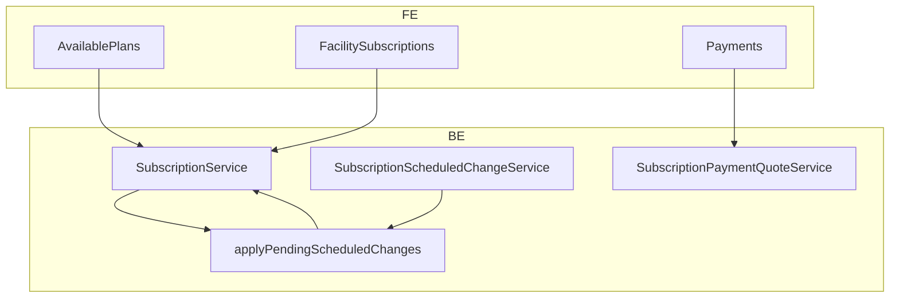

# Facility Subscription & Billing — Implementation Plan

**Date:** 2026-05-26  
**Status:** Approved for execution (decisions locked below)  
**Scope:** Frontend (`Frontend/`) + Backend (`Backend/`) — Plans & Subscriptions (facility admin)

---

## 1. Overview

### Problem today

- **Cancelled** on Subscriptions tab but **Current Plan** still shown on Available Plans (`isCurrent` = `plan.id` only).
- Cancel and plan changes **apply immediately** (access lost, cancel + recreate on upgrade/downgrade).
- `Payments.tsx` uses `plan price + onboarding` without context (renewal, onboarding already paid, upgrades).
- Trial copy hardcoded as **7 days**; BE already uses `plan.trial_days`.
- No proration, no scheduled changes table, no server-side payment quote.

### Goals

1. Truthful UI (current / scheduled / cancelled-with-access).
2. **Cancel at period end** when the facility has paid for the current cycle.
3. **Scheduled** upgrade/downgrade at **next billing cycle** (no charge now).
4. **Upgrade now** with **proration** (charge today, plan upgrades immediately).
5. **Payment quote** API drives `Payments.tsx`; server validates amounts.
6. **No cron** for scheduled changes — apply pending changes via a shared function whenever subscription state is resolved (read path + middleware).

---

## 2. Decisions (locked)

| # | Question | Decision |
|---|----------|----------|
| 1 | When cancelling after payment for this cycle, when does access end? | **End at period end** (`ends_at` / paid-through date), not immediately. |
| 2 | Who can cancel immediately (instant lockout)? | **Platform admin only.** Facility-facing cancel = **at period end** only. |
| 3 | When do scheduled upgrade/downgrade take effect? | **Next billing cycle** (`next_billing_date` / `effective_at`). |
| 4 | Charge when scheduling upgrade/downgrade for next cycle? | **No charge now** — new price at renewal. |
| 5 | Upgrade paths? | **Two paths:** (A) **Schedule upgrade** — next cycle, no payment now. (B) **Upgrade now** — plan changes immediately; **proration applies**; user pays quoted delta via Payments. |
| 6 | Proration formula (upgrade now)? | Daily within current period: `credit_unused = old_price × (days_remaining / days_in_period)`; `charge_new = new_price × (days_remaining / days_in_period)`; `due = max(0, charge_new − credit_unused)`. Store breakdown in payment / metadata. |
| 7 | Downgrade mid-cycle refund? | **No refund / no credit** in v1. Higher plan until period end; lower price from next cycle. |
| 8 | Currency? | **USD only** for v1 (matches existing Payments + bank transfer). |
| 9 | Plan card labels? | **Your plan** (informative pill, Custocare blue/cyan — not gray disabled button). **Starts on {date}** for scheduled target. **Access until {date}** when cancelled-at-period-end. No **Current** when `!has_access`. |
| 10 | Server validates payment amount? | **Yes** — `GET payment-quote` + reject `POST payment` if amount ≠ quote (±$0.01). |
| 11 | When are pending scheduled changes applied? | **On demand only** — `applyPendingScheduledChanges()` when subscription is loaded or access checked (**no cron job**). |
| 12 | Trial length? | Always **`plan.trial_days`** per plan (FE + BE); remove hardcoded 7-day copy. |

### Upgrade summary

| Action | Plan change | Payment now | Proration |
|--------|-------------|-------------|-----------|
| Schedule upgrade | Next billing cycle | No | No |
| Upgrade now | Immediate | Yes (quoted) | Yes |
| Schedule downgrade | Next billing cycle | No | No |
| Cancel (facility) | Cancelled at period end | No | No |

---

## 3. Architecture



### Apply pending changes (no cron)

`applyPendingScheduledChanges(Subscription $subscription): Subscription` runs when:

- `GET /api/facilities/{facility}/subscription`
- `SubscriptionService::getSubscriptionForFacility()` (internal)
- `EnsureFacilitySubscriptionIsActive` middleware (before access decision)

Logic:

1. Load `pending` row from `subscription_scheduled_changes` where `effective_at <= now()`.
2. If none, return subscription unchanged.
3. Apply by `change_type`:
   - `upgrade` / `downgrade` / `plan_change` → update `plan_id`, sync modules, clear pending row → `applied`.
   - `cancel` → set `status = cancelled`, `cancelled_at`, clear flags → `applied`.
4. For **upgrade now**, do **not** use scheduled row — update `plan_id` immediately in dedicated service method after payment quote / confirmation.

Only **one** pending scheduled change per subscription (DB unique partial index).

---

## 4. Database

### New table: `subscription_scheduled_changes`

| Column | Type | Notes |
|--------|------|--------|
| `id` | bigint PK | |
| `subscription_id` | FK → subscriptions | |
| `facility_id` | FK → facilities | |
| `change_type` | enum | `upgrade`, `downgrade`, `cancel`, `plan_change` |
| `from_plan_id` | FK nullable | |
| `to_plan_id` | FK nullable | null for cancel |
| `effective_at` | timestamp | Usually `subscription.next_billing_date` |
| `status` | enum | `pending`, `applied`, `cancelled` |
| `proration_amount_usd` | decimal nullable | For audit; scheduled upgrade = null |
| `requested_by_user_id` | FK nullable | |
| `metadata` | json nullable | Quote breakdown, notes |
| `timestamps` | | |

**Index:** unique `(subscription_id)` where `status = pending`.

### Subscription model / metadata (cancel at period end)

Until applied cancel row fires:

- `status` remains `active` (or `trial` / `past_due` with access).
- `metadata.cancel_at_period_end` = true
- `metadata.access_ends_at` = ISO8601 (copy of `ends_at`)

`Subscription::hasAccess()` must return true while `now() < access_ends_at` even if cancel is scheduled.

---

## 5. Backend (SOLID)

| Piece | Location |
|-------|----------|
| Migration | `database/migrations/..._create_subscription_scheduled_changes_table.php` |
| Model | `app/Models/SubscriptionScheduledChange.php` |
| Repository interface + impl | `app/Repositories/Billing/Contracts/...`, `.../SubscriptionScheduledChangeRepository.php` |
| Service | `app/Services/Billing/SubscriptionScheduledChangeService.php` |
| Quote service | `app/Services/Billing/SubscriptionPaymentQuoteService.php` |
| Extend | `SubscriptionService` — cancel modes, `upgradeNow()`, `schedulePlanChange()`, wire `applyPendingScheduledChanges` |
| Resource | `SubscriptionResource` — `scheduled_change`, `cancel_at_period_end`, `access_ends_at`, `effective_plan` |
| Provider bindings | `bootstrap/providers.php` (dedicated provider if needed) |
| Routes | `routes/api/...` under facility subscription group |

### API endpoints

| Method | Path | Purpose |
|--------|------|---------|
| GET | `/facilities/{facility}/subscription` | Show subscription; **runs apply pending** before response |
| POST | `/facilities/{facility}/subscription/cancel` | Body: `{ reason?, mode: 'at_period_end' \| 'immediate' }` |
| POST | `/facilities/{facility}/subscription/schedule-change` | Body: `{ plan_id, change_type: 'upgrade' \| 'downgrade' }` |
| POST | `/facilities/{facility}/subscription/upgrade-now` | Body: `{ plan_id }` — immediate plan swap + returns quote reference |
| DELETE | `/facilities/{facility}/subscription/scheduled-change` | Cancel pending scheduled change |
| GET | `/facilities/{facility}/subscription/payment-quote` | Query: `plan_id?`, `intent` — line items + total |

### Payment quote intents

| Intent | Typical total |
|--------|----------------|
| `first_activation` | monthly + onboarding (if not paid) |
| `renewal` | monthly only |
| `scheduled_change` | **0** (copy explains charge at renewal) |
| `upgrade_now` | proration due |
| `trial_activation` | per trial / onboarding rules |

`PaymentService::recordPayment()` validates amount against latest quote for subscription + intent.

### Proration (upgrade now)

```
days_remaining  = max(0, days between now and ends_at)
days_in_period  = max(1, days between starts_at and ends_at)
credit_unused   = old_price_usd * (days_remaining / days_in_period)
charge_new      = new_price_usd * (days_remaining / days_in_period)
proration_due   = round(max(0, charge_new - credit_unused), 2)
```

Persist breakdown in `payments.metadata` and/or `subscription_scheduled_changes.metadata` when relevant.

### Remove anti-pattern

- Stop FE flow: `cancelSubscription` → `createSubscription` for upgrade/downgrade.
- Do not set `status = cancelled` immediately on facility cancel when `mode = at_period_end`.

---

## 6. Frontend

| Area | Files |
|------|--------|
| Types | `SubscriptionTypes.ts` — scheduled change, cancel_at_period_end, quote types |
| Queries | `SubscriptionQueries.ts` — schedule-change, upgrade-now, payment-quote, cancel with mode |
| Available Plans | `AvailablePlans.tsx` — `isCurrent` / badges / Schedule vs Upgrade now CTAs |
| Subscriptions | `FacilitySubscriptions.tsx` — cancelled-at-period-end copy |
| Payments | `Payments.tsx` — consume quote API only |
| Utils | `subscriptionDisplayUtils.ts` (optional) — shared labels |
| Search | `searchModules.ts` — already has contacts; no change required for this plan |

### Available Plans CTAs (active paid, not in trial)

- Target plan **higher price**: **Schedule upgrade** + **Upgrade now** (primary/secondary).
- Target plan **lower price**: **Schedule downgrade** only.
- Current plan: informative **Your plan** pill (not disabled button).

### Trial copy

Use `plan.trial_days` in confirm dialogs and banners.

---

## 7. Implementation order (single execution pass)

Execute in this order to avoid rework:

| Step | Work | Stack |
|------|------|--------|
| **1** | Migration + model + repository + provider bindings | BE |
| **2** | `applyPendingScheduledChanges()` + integrate into `getSubscriptionForFacility` + middleware | BE |
| **3** | Cancel `at_period_end` vs `immediate`; update `hasAccess()` | BE |
| **4** | `schedulePlanChange()` + DELETE pending + `SubscriptionResource` fields | BE |
| **5** | `upgradeNow()` + proration calculator | BE |
| **6** | `SubscriptionPaymentQuoteService` + quote validation on `recordPayment` | BE |
| **7** | API routes + Form Requests + PHPUnit (apply, cancel at period end, proration, quote) | BE |
| **8** | FE types + React Query hooks for new endpoints | FE |
| **9** | `AvailablePlans.tsx` — labels, CTAs, remove cancel+recreate | FE |
| **10** | `FacilitySubscriptions.tsx` — aligned cancelled / access-until copy | FE |
| **11** | `Payments.tsx` — quote-driven line items + intents | FE |
| **12** | Vera fast (+ BE extended if migrations/entities); update `docs/decisions.md` ADR + `Backend/docs/entities.md` | Both |

**Architect (Blue):** Run — 3+ files, cross-stack, new table.  
**Quill:** Update `docs/decisions.md` + `Backend/docs/entities.md` after Vera pass.

---

## 8. Testing checklist

### Backend

- [ ] Facility cancel `at_period_end` → still `has_access` until `ends_at`; after `effective_at`, status `cancelled`.
- [ ] Platform admin `immediate` cancel → instant no access.
- [ ] Schedule upgrade → `plan_id` unchanged until `applyPending` when `effective_at` passed.
- [ ] `applyPending` on GET subscription (no cron).
- [ ] Upgrade now → `plan_id` updates immediately; quote proration matches formula.
- [ ] Payment record rejects amount ≠ quote.
- [ ] Only one pending scheduled change per subscription.

### Frontend

- [ ] Cancelled + access until date → no misleading **Current** badge.
- [ ] Schedule upgrade → banner on target plan with date.
- [ ] Upgrade now → navigates to Payments with proration line items.
- [ ] Trial confirm uses plan’s `trial_days`.
- [ ] **Your plan** pill styling (blue/cyan, not gray disabled).

---

## 9. Out of scope (v1)

- UGX pricing / multi-currency checkout
- Downgrade proration / refunds
- Automated card billing (still bank transfer + admin approve)
- Cron-based subscription jobs for scheduled changes (explicitly **not** used)

---

## 10. Related files (reference)

### Frontend

- `src/renderer/modules/administration/admin-module/ui/plans-and-subscriptions/AvailablePlans.tsx`
- `src/renderer/modules/administration/admin-module/ui/plans-and-subscriptions/FacilitySubscriptions.tsx`
- `src/renderer/modules/administration/admin-module/ui/plans-and-subscriptions/Payments.tsx`
- `src/renderer/modules/administration/admin-module/api/subscriptions/SubscriptionQueries.ts`
- `src/renderer/modules/administration/admin-module/api/subscriptions/SubscriptionTypes.ts`

### Backend

- `app/Services/Billing/SubscriptionService.php`
- `app/Services/Billing/PaymentService.php`
- `app/Models/Subscription.php`
- `app/Http/Controllers/Api/Billing/SubscriptionController.php`
- `app/Http/Resources/Billing/SubscriptionResource.php`
- `app/Http/Middleware/EnsureFacilitySubscriptionIsActive.php`
- `app/Console/Commands/Billing/CheckSubscriptionStatuses.php` (unchanged for scheduled plan changes; may still handle past_due / trial expiry)

---

*Document owner: Mike (orchestrator). Execute Rex against this plan after Oscar confirms no further edits to §2.*
